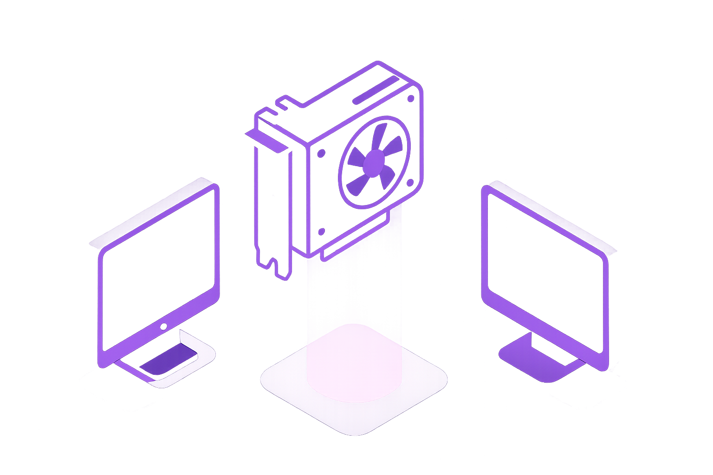

# BugBash Talk Slides

## Introduction

(Regular introduction about the company etc. here)

## The Problem Landscape

### The Impossible Choice

**"Pay full price or risk losing critical work"**

- 70-90% savings with spot instances
- But 30-120 second termination notice
- Catastrophic for stateful workloads

---

### The Cost of Status Quo

- Hundreds of thousands of dollars spent annually on CI compute that could have been spent on engineering instead
- Fewer tests, shorter fuzzing sessions
- Innovation constrained by infrastructure limitations

---

### Current Approaches: All Suboptimal

1. ❌ Expensive on-demand instances
2. ❌ Spots only for stateless jobs
3. ❌ Complex custom checkpointing
4. ❌ Accept failures and retry

---

## The Cloud Lock-In Problem

- Cloud providers commoditize compute while you can't
- Lack of digital sovereignty
- Artificial barriers prevent true workload portability

---

## Introducing Architect

### Introduction

**"Transform unreliable spot instances into a unified, failure-proof compute fabric"**

---

### Key Capabilities

1. **Live migration**: Under 10 seconds
2. **Cross-provider compatibility**: AWS, GCP, Azure, on-prem
3. **Zero application changes**: Works with existing pipelines

---

## The Technology Stack

- **PVM**: Portable Virtual Machine (foundation)
- **Drafter**: Compute migration
- **Silo**: Data plane
- **Conduit**: Connection migration
- **Mirage**: GPU migration

---

### PVM: The Foundation

- Enables fully accelerated VMs without hardware support
- Compatible with existing hypervisors
- First patches in Linux Kernel early 2024
- True workload portability across clouds

---

### Drafter: Compute Migration

- "Lightweight VMmotion for the cloud"
- CPU templates ensure consistent environments
- Continuous snapshotting via modified Firecracker
- Full VM lifecycle management

---

### Silo: Data Plane

- Tracks memory reads/writes during migration
- VM continues operating during transfer
- Intelligent memory chunk prioritization
- P2P and S3-based migration support

---

### Conduit: Connection Migration

- eBPF-based TCP/UDP connection migration
- All connections transfer intact:
  - WebSockets
  - gRPC streams
  - SSH sessions
- Zero application timeout failures

---

### Mirage: GPU Workload Migration

- Migrate GPU workloads across hosts
- Preserve CUDA contexts
- ML training continues exactly where it left off
- Works across different instance types

---

## Migration Policy Engine

- Real-time orchestration
- Preemption response
- Cost optimization
- Resource matching
- Cross-availability zone redundancy

---

## The Demo

(Just "Demo" in the slides)

## Conclusion

Architect eliminates the cost excuse for not fixing bugs. With 90% lower compute costs you can:

- Run 10x more tests
- Find more bugs where it matters
- And build more reliable software together

## Join the Beta

- GitHub Actions integration launching soon
- Visit **architect.io** to join waitlist
- Find me after for technical discussion
